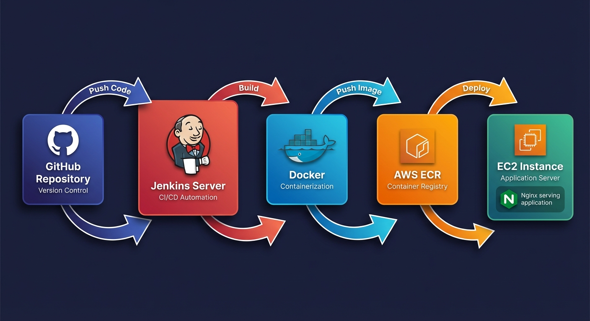

# 🚀 Resume Builder - CI/CD Pipeline with AWS

[](https://www.jenkins.io/)
[](https://www.docker.com/)
[](https://aws.amazon.com/)
[](https://nginx.org/)

A complete **DevOps CI/CD pipeline** project demonstrating automated deployment of a React application to AWS using Jenkins, Docker, and Nginx.

---

## 📋 Table of Contents

- [Architecture Overview](#-architecture-overview)
- [Tech Stack](#-tech-stack)
- [Project Structure](#-project-structure)
- [Features](#-features)
- [Prerequisites](#-prerequisites)
- [Quick Start](#-quick-start)
- [Detailed Setup Guide](#-detailed-setup-guide)
- [Pipeline Stages](#-pipeline-stages)
- [Configuration](#-configuration)
- [Monitoring & Logging](#-monitoring--logging)
- [Troubleshooting](#-troubleshooting)
- [Contributing](#-contributing)
- [License](#-license)

---

## 🏗️ Architecture Overview



```
┌─────────────────────────────────────────────────────────────────────────────┐
│                           CI/CD PIPELINE ARCHITECTURE                        │
└─────────────────────────────────────────────────────────────────────────────┘

    ┌──────────┐         ┌──────────────┐         ┌─────────────┐
    │  GitHub  │ ──────► │   Jenkins    │ ──────► │   AWS ECR   │
    │   Repo   │ Webhook │   Server     │  Push   │  Registry   │
    └──────────┘         └──────────────┘         └─────────────┘
                                │                        │
                                │ Build                  │ Pull
                                ▼                        ▼
                         ┌──────────────┐         ┌─────────────┐
                         │    Docker    │         │    EC2      │
                         │    Image     │ ──────► │   Server    │
                         └──────────────┘  Deploy └─────────────┘
                                                        │
                                                        ▼
                                                 ┌─────────────┐
                                                 │   Nginx     │
                                                 │   + App     │
                                                 └─────────────┘
                                                        │
                                                        ▼
                                                 ┌─────────────┐
                                                 │    Users    │
                                                 └─────────────┘
```

### Detailed Flow

```
┌─────────────────────────────────────────────────────────────────────────────┐
│                                                                              │
│    Developer          GitHub           Jenkins          AWS                 │
│        │                │                 │               │                 │
│        │   Push Code    │                 │               │                 │
│        │───────────────►│                 │               │                 │
│        │                │   Webhook       │               │                 │
│        │                │────────────────►│               │                 │
│        │                │                 │               │                 │
│        │                │                 │  Docker Build │                 │
│        │                │                 │──────────────►│                 │
│        │                │                 │               │                 │
│        │                │                 │  Push to ECR  │                 │
│        │                │                 │──────────────►│  ECR            │
│        │                │                 │               │                 │
│        │                │                 │  Deploy       │                 │
│        │                │                 │──────────────►│  EC2            │
│        │                │                 │               │                 │
│        │                │                 │  Health Check │                 │
│        │                │                 │◄──────────────│                 │
│        │                │                 │               │                 │
│        │   Success!     │                 │               │                 │
│        │◄───────────────│◄────────────────│               │                 │
│                                                                              │
└─────────────────────────────────────────────────────────────────────────────┘
```

---

## 🛠️ Tech Stack

| Category | Technology |
|----------|------------|
| **CI/CD** | Jenkins |
| **Containerization** | Docker |
| **Container Registry** | AWS ECR |
| **Cloud Platform** | AWS (EC2, ECR, IAM) |
| **Web Server** | Nginx |
| **Version Control** | Git, GitHub |
| **Application** | React + TypeScript + Vite |
| **Backend Services** | Supabase |

---

## 📁 Project Structure

```
resume-builder-devops/
├── 📄 README.md                 # This file
├── 📄 Dockerfile                # Multi-stage Docker build
├── 📄 Jenkinsfile               # CI/CD Pipeline definition
├── 📄 docker-compose.yml        # Local development setup
├── 📄 docker-compose.prod.yml   # Production deployment
├── 📄 .dockerignore             # Docker build exclusions
├── 📁 nginx/
│   ├── nginx.conf               # Main Nginx configuration
│   ├── default.conf             # Server block configuration
│   └── proxy.conf               # Reverse proxy for production
├── 📁 scripts/
│   ├── setup-jenkins.sh         # Jenkins server setup script
│   ├── setup-app-server.sh      # Application server setup
│   └── deploy.sh                # Manual deployment script
└── 📁 docs/
    ├── DEPLOYMENT_GUIDE.md      # Detailed deployment guide
    └── TROUBLESHOOTING.md       # Common issues and solutions
```

---

## ✨ Features

### CI/CD Pipeline
- ✅ **Automated Builds**: Triggered on every push to main branch
- ✅ **Docker Multi-stage Build**: Optimized image size
- ✅ **AWS ECR Integration**: Secure container registry
- ✅ **Automated Deployment**: Zero-downtime deployment to EC2
- ✅ **Health Checks**: Automatic verification after deployment

### Infrastructure
- ✅ **Nginx Reverse Proxy**: SSL termination and load balancing
- ✅ **Docker Containerization**: Consistent environments
- ✅ **Environment Variables**: Secure secrets management
- ✅ **Gzip Compression**: Optimized content delivery
- ✅ **Security Headers**: XSS, CSRF protection

### Monitoring
- ✅ **Container Health Checks**: Built-in Docker health monitoring
- ✅ **Nginx Access Logs**: Request logging and analysis
- ✅ **Jenkins Build History**: Pipeline execution tracking

---

## 📋 Prerequisites

### AWS Account
- EC2 instances (2x - Jenkins + App server)
- ECR repository
- IAM roles with appropriate permissions

### Local Development
- Docker Desktop
- Git
- Node.js 20+

### Jenkins Server Requirements
- Ubuntu 22.04 LTS
- Java 17+
- Docker
- AWS CLI

---

## 🚀 Quick Start

### 1. Clone the Repository

```bash
git clone https://github.com/yourusername/resume-builder-devops.git
cd resume-builder-devops
```

### 2. Local Development with Docker

```bash
# Build and run locally
docker-compose up --build

# Access the application
open http://localhost:3000
```

### 3. Production Deployment

```bash
# Deploy with SSL (on EC2)
docker-compose -f docker-compose.prod.yml up -d
```

---

## 📖 Detailed Setup Guide

### Step 1: AWS Infrastructure Setup

#### EC2 Instances

**Jenkins Server:**
- Instance Type: `t3.small` or `t3.medium`
- AMI: Ubuntu 22.04 LTS
- Storage: 20GB
- Security Group Ports: 22, 8080

**Application Server:**
- Instance Type: `t3.micro` or `t3.small`
- AMI: Ubuntu 22.04 LTS
- Storage: 10GB
- Security Group Ports: 22, 80, 443, 3000

#### ECR Repository

```bash
# Create ECR repository
aws ecr create-repository --repository-name resume-builder --region ap-south-1
```

### Step 2: Jenkins Server Setup

SSH into Jenkins server and run:

```bash
#!/bin/bash
# Update system
sudo apt update && sudo apt upgrade -y

# Install Java
sudo apt install -y fontconfig openjdk-17-jdk

# Install Docker
sudo apt install -y docker.io
sudo systemctl start docker
sudo systemctl enable docker
sudo usermod -aG docker ubuntu

# Install Jenkins
sudo wget -O /usr/share/keyrings/jenkins-keyring.asc \
  https://pkg.jenkins.io/debian-stable/jenkins.io-2023.key
echo "deb [signed-by=/usr/share/keyrings/jenkins-keyring.asc] \
  https://pkg.jenkins.io/debian-stable binary/" | \
  sudo tee /etc/apt/sources.list.d/jenkins.list > /dev/null
sudo apt update
sudo apt install -y jenkins

# Add jenkins to docker group
sudo usermod -aG docker jenkins
sudo systemctl restart jenkins

# Install AWS CLI
curl "https://awscli.amazonaws.com/awscli-exe-linux-x86_64.zip" -o "awscliv2.zip"
sudo apt install -y unzip
unzip awscliv2.zip
sudo ./aws/install

# Show Jenkins initial password
echo "=== Jenkins Initial Password ==="
sudo cat /var/lib/jenkins/secrets/initialAdminPassword
```

### Step 3: Configure Jenkins Credentials

Add these credentials in Jenkins (Manage Jenkins → Credentials):

| ID | Type | Description |
|----|------|-------------|
| `aws-ecr-registry` | Secret text | ECR registry URL |
| `vite-openrouter-api-key` | Secret text | OpenRouter API Key |
| `vite-supabase-url` | Secret text | Supabase URL |
| `vite-supabase-anon-key` | Secret text | Supabase Anon Key |
| `ec2-host-ip` | Secret text | App EC2 Public IP |
| `ec2-ssh-key` | SSH Username with private key | EC2 SSH Key |
| `github-credentials` | Username with password | GitHub PAT |

### Step 4: Create Jenkins Pipeline

1. New Item → Pipeline
2. Pipeline from SCM → Git
3. Repository URL: Your GitHub repo
4. Branch: `*/main`
5. Script Path: `Jenkinsfile`

---

## 🔄 Pipeline Stages

```
┌─────────────────────────────────────────────────────────────────┐
│                     JENKINS PIPELINE STAGES                      │
└─────────────────────────────────────────────────────────────────┘

    ┌──────────┐    ┌──────────┐    ┌──────────┐    ┌──────────┐
    │ Checkout │───►│  Docker  │───►│ Push to  │───►│ Deploy   │
    │   Code   │    │  Build   │    │   ECR    │    │ to EC2   │
    └──────────┘    └──────────┘    └──────────┘    └──────────┘
                                                          │
                                                          ▼
                                                    ┌──────────┐
                                                    │  Health  │
                                                    │  Check   │
                                                    └──────────┘
```

| Stage | Description | Duration |
|-------|-------------|----------|
| **Checkout** | Clone repository from GitHub | ~5s |
| **Docker Build** | Multi-stage build with Nginx | ~60s |
| **Push to ECR** | Tag and push to AWS ECR | ~10s |
| **Deploy to EC2** | SSH deploy and restart container | ~15s |
| **Health Check** | Verify application is running | ~10s |

---

## ⚙️ Configuration

### Environment Variables

| Variable | Description |
|----------|-------------|
| `VITE_OPENROUTER_API_KEY` | OpenRouter API key for AI features |
| `VITE_SUPABASE_URL` | Supabase project URL |
| `VITE_SUPABASE_ANON_KEY` | Supabase anonymous key |

### Nginx Configuration

The application uses Nginx with:
- Gzip compression enabled
- Static file caching
- SPA routing support
- Security headers

### Docker Build

Multi-stage build process:
1. **Stage 1 (Builder)**: Node.js builds the React app
2. **Stage 2 (Production)**: Nginx serves the built assets

---

## 📊 Monitoring & Logging

### Container Logs

```bash
# View application logs
docker logs resume-builder-app

# Follow logs in real-time
docker logs -f resume-builder-app
```

### Nginx Access Logs

```bash
# Access logs
docker exec resume-builder-app cat /var/log/nginx/access.log

# Error logs
docker exec resume-builder-app cat /var/log/nginx/error.log
```

### Health Check

```bash
# Check container health
docker inspect --format='{{.State.Health.Status}}' resume-builder-app

# Manual health check
curl http://localhost:3000/health
```

---

## 🔧 Troubleshooting

### Common Issues

| Issue | Solution |
|-------|----------|
| Docker permission denied | `sudo usermod -aG docker jenkins && sudo systemctl restart jenkins` |
| ECR login failed | Configure AWS CLI: `aws configure` |
| SSH connection timeout | Check security group rules |
| Health check failing | Verify port 3000 is open |

### Debug Commands

```bash
# Check Docker status
sudo systemctl status docker

# Check Jenkins status
sudo systemctl status jenkins

# List running containers
docker ps

# Check container logs
docker logs resume-builder-app
```

---

## 🤝 Contributing

1. Fork the repository
2. Create a feature branch: `git checkout -b feature/amazing-feature`
3. Commit changes: `git commit -m 'Add amazing feature'`
4. Push to branch: `git push origin feature/amazing-feature`
5. Open a Pull Request

---

## 📄 License

This project is licensed under the MIT License - see the [LICENSE](LICENSE) file for details.

---

## 👨‍💻 Author

**John Smilin DS**

- GitHub: [@Smilin01](https://github.com/Smilin01)
- LinkedIn: [Your LinkedIn](https://www.linkedin.com/in/johnsmilin/)

---

## 🙏 Acknowledgments

- [Jenkins Documentation](https://www.jenkins.io/doc/)
- [Docker Documentation](https://docs.docker.com/)
- [AWS Documentation](https://docs.aws.amazon.com/)
- [Nginx Documentation](https://nginx.org/en/docs/)

---

<p align="center">
  <b>⭐ Star this repository if you found it helpful!</b>
</p>
